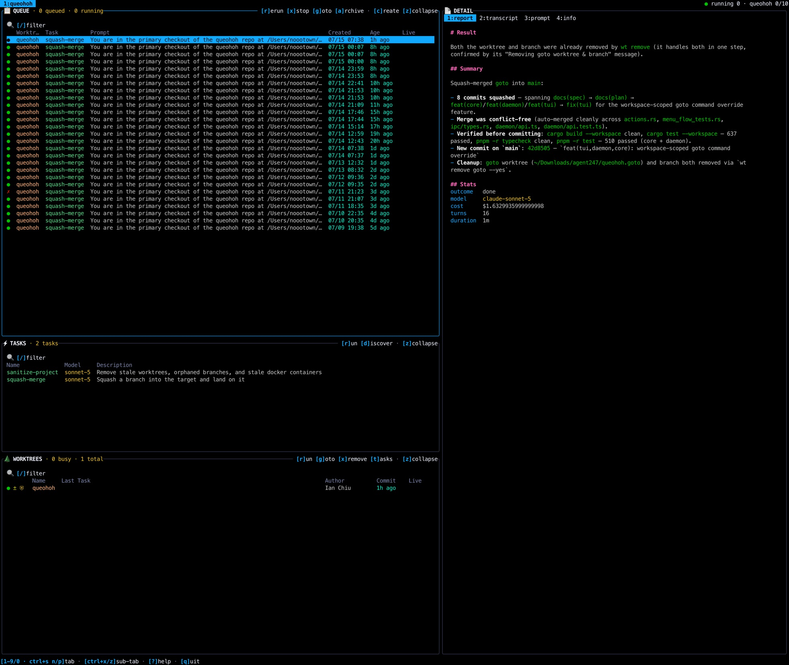

# queohoh

A task-queue orchestrator for coding agents. queohoh schedules headless Claude Code runs across git worktrees, one project at a time under a concurrency cap, and gives you a terminal cockpit to watch and steer them.



A TypeScript **daemon** owns all state: it holds the queue, spawns runs, enriches worktrees with `git`/`gh` data, runs cron and verify gates, and serves JSON-RPC over a unix socket. A Rust ratatui **TUI** (`qoo`) is a pure client that renders the daemon's snapshots and sends commands back. An **MCP server** (embedded in the daemon) is the programmatic enqueue surface used by the `/qoo` Claude Code skill.

## How it fits together

```
/qoo skill ──MCP──▶ ┌────────────────────┐          ┌─────────────────────┐
                    │  daemon (TS)       │◀─JSON-RPC│  qoo-tui (Rust)     │
git / gh ◀──exec────│  queue engine,     │  unix    │  Elm-style client,  │
claude ◀───spawn────│  worktree+PR       │  socket─▶│  renders snapshots  │
                    │  enrichment, runs  │          │  + run files        │
                    └────────────────────┘          └─────────────────────┘
```

The daemon is the single writer of all state; the TUI never touches git or task state directly. Runs are detached through a per-run shim process, so a daemon reload or crash never kills a run in flight — a returning daemon re-adopts live runs and finalizes completed ones from their run-dir files.

## Config lives in a separate workspace

This repo is the daemon and TUI **source**. The projects you orchestrate, and the task definitions you run against them, live in a **private config workspace** you own (not this git tree).

Point the daemon at it with an environment variable (preferred — no personal paths in the product):

```bash
export QUEOHOH_WORKSPACE=~/path/to/your-config-workspace
# daemon then reads: $QUEOHOH_WORKSPACE/config.yaml
```

Optional overrides: `QUEOHOH_CONFIG` (explicit config file), `QUEOHOH_STATE_DIR` (runtime state; default `~/.local/state/queohoh`). Task definitions sit under `$QUEOHOH_WORKSPACE/<project>/tasks/<name>/`. See `docs/setup.md` for the schema, builtin template vars, and verify/done-condition setup.

## Repo layout

| Path | What lives there |
| --- | --- |
| `packages/core/` | Shared TS domain layer: worktree/ref resolution, task-definition model, config, queue dedup. No I/O policy of its own. |
| `packages/daemon/` | The daemon — queue engine, git/PR enrichment, JSON-RPC API + `StateSnapshot`, MCP server, run shim, hot self-restart, CLI entry points. The single writer of all state. |
| `crates/qoo-tui/` | The Rust ratatui TUI: `ipc/` wire layer, pure `selectors.rs` derivations, Elm-style `app/` state+update, pure `view/` render functions, event loop, hit-testing. |
| `examples/` | Example task definitions and a minimal reference `/qoo` skill. Source of truth to copy into your workspace / skills dir — the daemon does not read this directory. |
| `scripts/` | `daemon-ensure.sh`: build and (re)start the daemon. |
| `docs/` | `setup.md` (install/config/run walkthrough) and supporting material. |

## Build and run

Requires Node 22 and Rust 1.97 (pinned in `.mise.toml`); commands assume [mise](https://mise.jdx.dev/) and pnpm.

```bash
mise run sync            # install all workspace deps and build once
mise run build           # compile core + daemon to dist/
mise run check           # full gate: TS test/typecheck/lint + Rust test/check/clippy
```

Run the pieces:

```bash
mise run daemon          # run the daemon in the foreground (rebuilds first)
mise run daemon:ensure   # start a detached daemon if none is running
mise run status          # print daemon state JSON over the socket
mise run tui             # rebuild+restart daemon from this worktree, build TUI, launch
mise run tui:rs:dev      # run the TUI unoptimized for a fast rebuild loop
```

In a secondary worktree where the daemon runs from the main checkout, use `mise run tui --no-daemon` (attach-only, no self-heal) so two TUIs don't fight over restarting the shared daemon.

Integrations:

```bash
mise run mcp:register    # register the queohoh MCP server with Claude Code, Codex, and Grok Build (skips CLIs not on PATH)
mise run launchd:up      # install the launchd plist and keep the daemon alive (macOS)
mise run launchd:down    # stop the launchd daemon and remove the plist
```

## More

`AGENTS.md` is the architecture guide — data flow, module hierarchy, and the invariants (single-writer daemon, detached-run shim, one-directional wire compat, Elm-style TUI, HitMap mouse model, fixed-width columns) that changes must preserve. `docs/setup.md` covers configuration and day-to-day operation in detail.
